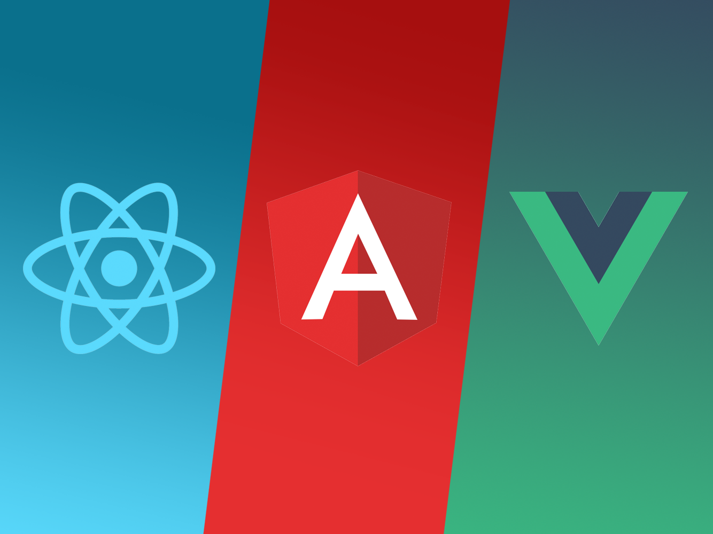

# A Comparison of Frontend JavaScript Frameworks

## React vs. Angular vs. Vue

Are you interested in learning a frontend JavaScript framework but don't know which one is the best fit for you or your team? Or maybe you're currently using a framework and you're interested in what another framework has to offer?

In this talk, we'll compare React, Angular, and Vue. What are the strengths and weaknesses of each? What are the similarities? What are the differences? How easy are they to learn? What are the other considerations you should keep in mind?

## About James

James is a self-confessed geek, who enjoys talking about programming and learning new technologies. At the beginning of 2016, he joined the Treehouse team as a teacher and is excited to have the opportunity to help beginners become developers. In addition to his teaching responsibilities at Treehouse, James enjoys participating in the developer community, presenting talks in Oregon, Washington, Idaho, Utah, Tennessee, and Kentucky.

Twitter: [SmashDev](https://twitter.com/SmashDev)
